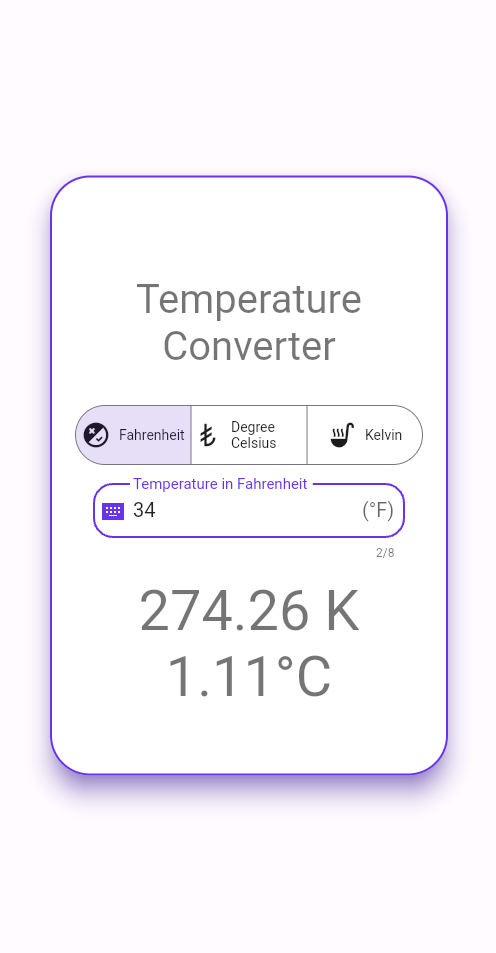
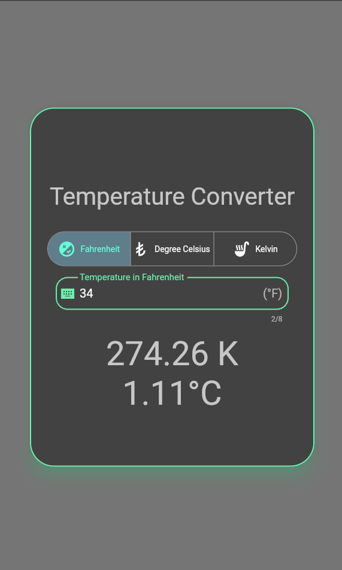
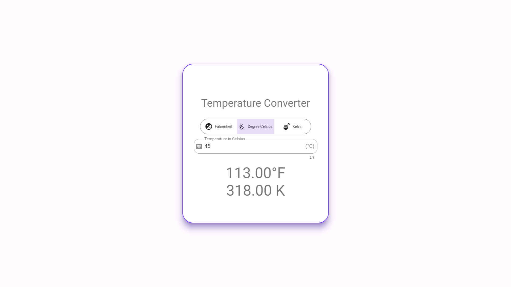
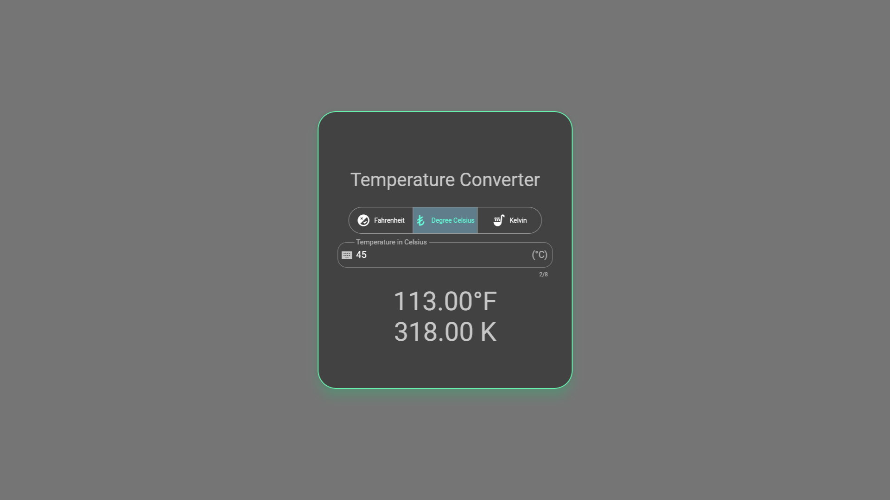
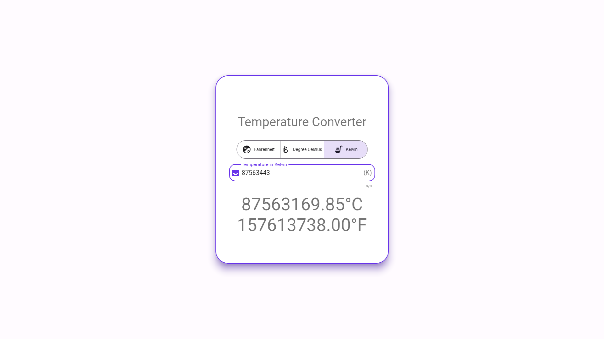

# Temperature calculator

A new Flutter Calculator project made using material components and setState.

# Steps to run this project from source:

## Step 1: Clone this repo

## Step 2: Get all dependencies by `flutter pub get`

## Step 3: Run this project by hitting `flutter run`

> for creating release build(optional): `flutter build web`

# Previews

